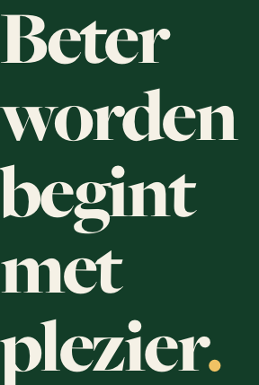
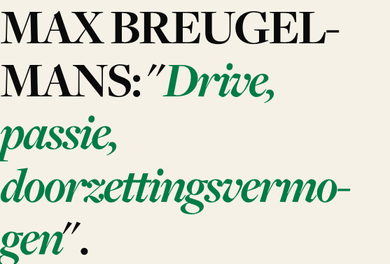
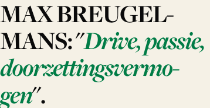

# Display clamps, fallback faces and font-display, measured in a browser (#2669)

Measured 2026-09-29 against the deployed redesign `https://kcvv-nextjs.vercel.app` in Playwright
Chromium (headless, macOS 26, Node 24). The real Freight faces were loaded (`document.fonts` entries
`loaded`) for every real-face number. The ramp values in `apps/web/src/app/globals.css:466-480` on
`main` (`2a591897f`) match the deploy: the 768 px browser sizes equal the clamp formulas to the
hundredth (85.44 / 62.40 / 43.04 / 27.52 / 23.68).

Part **(a)**, the reading measure, was answered 2026-08-12. This file only re-checks one number for it.
Parts **(b1)–(b3)** are new.

Facts come first (§1–§4) and the recommendations are kept apart in §6.

---

## 1. Reading measure — one-number re-check at 1440 px

| Page (1440 px)                          | Column | Body               | Chars per full line   |
| --------------------------------------- | ------ | ------------------ | --------------------- |
| News article (`kcvv-elewijt-b-stelt…`)  | 680 px | 16 px Freight Sans | 93 (5-line paragraph) |
| Interview (`maxim-breugelmans…`), prose | 680 px | 16 px              | 89, 91, 92            |
| Interview, Q&A answer                   | 636 px | 16 px              | 85, 104               |
| `/club/ultras` body                     | 680 px | 16 px              | 104–106               |

The count is characters per line box, from per-character `Range.getClientRects()` tops, with the last
line left out. **The earlier "109 CPL at 1440" does not reproduce: the same 680 px column measures
89–106 CPL, depending on the text.** Either way it is still well above the usual 66–75 target. The
conclusion of (a) stands; only the figure changes.

---

## 2. (b1) Display clamps

### 2.1 Resolved font-size per step, measured and computed

These are the computed `font-size` values of real elements on the pages in §2.3. They equal the clamp
formula at every width.

| Step        | 390 | 768   | 1024  | 1280 | 1440 | Floor until | Ceiling from |
| ----------- | --- | ----- | ----- | ---- | ---- | ----------- | ------------ |
| display-2xl | 56  | 85.44 | 96    | 96   | 96   | 400 px      | 900 px       |
| display-xl  | 44  | 62.40 | 72    | 72   | 72   | 400 px      | 960 px       |
| display-lg  | 32  | 43.04 | 48    | 48   | 48   | 400 px      | 933 px       |
| display-md  | 24  | 27.52 | 31.36 | 32   | 32   | **533 px**  | 1067 px      |
| display-sm  | 20  | 23.68 | 24    | 24   | 24   | 400 px      | 800 px       |

### 2.2 Adjacent-step ratios and gaps (computed from the clamps, 300–2000 px in 1 px steps)

| Width | 2xl/xl | xl/lg | lg/md | md/sm     | Smallest gap      |
| ----- | ------ | ----- | ----- | --------- | ----------------- |
| ≤400  | 1.273  | 1.375 | 1.333 | 1.200     | md–sm 4.0 px      |
| 533   | 1.316  | 1.407 | 1.500 | **1.125** | md–sm **2.67 px** |
| 600   | 1.333  | 1.421 | 1.520 | 1.136     | md–sm 3.0 px      |
| 768   | 1.369  | 1.450 | 1.564 | 1.162     | md–sm 3.8 px      |
| 1024  | 1.333  | 1.500 | 1.531 | 1.307     | md–sm 7.4 px      |
| ≥1067 | 1.333  | 1.500 | 1.500 | 1.333     | md–sm 8.0 px      |

- **No step ever reaches or passes the one below it.** Only one pair comes within ~3 px: **md/sm**. Its
  gap narrows from 4 px at 400 px to **2.67 px at 534 px** (ratio 1.125), and stays under 4 px up to
  about 800 px. The cause is that `md` holds its 24 px floor until 533 px, while `sm` (and every other
  step) starts growing at 400 px.
- The next-closest pair is lg/md, at 8 px minimum. 2xl/xl and xl/lg never get closer than 12 px.
- Below 400 px the whole ramp is flat: every step sits at its floor.
- Weight also sets the two apart in practice: `sm` titles render at 600, and `md` at 700.

### 2.3 Where each step appears (real pages, all at real face)

Pages surveyed: `/`, `/nieuws`, a news article, an interview, `/club/geschiedenis`, `/wedstrijd/3434`,
`/ploegen/eerste-elftallen-a`, `/club/ultras`, `/jeugd`, `/spelers/12882`. That is 10 pages at 5 widths.

| Step | Face / weight                                                                 | Where                                                                                           |
| ---- | ----------------------------------------------------------------------------- | ----------------------------------------------------------------------------------------------- |
| 2xl  | Freight Big 900                                                               | `<PageHero>` landing heroes (`/jeugd`), `<UltrasHero>`, player/staff hero first name            |
| xl   | Freight Display 700 (Big 900 for ultras stat numbers, 400 for player surname) | article + interview H1, homepage lead story, `/nieuws`, `/club/geschiedenis`, team hero         |
| lg   | Display 700                                                                   | homepage section titles (Laatste nieuws, sponsors, clubkledij, Balletjesfestival), `/jeugd` CTA |
| md   | Display 700                                                                   | homepage featured-column titles, team/match section headers, "Blijf nog even hangen."           |
| sm   | Display 600 (400 italic for hero leads)                                       | news-card titles, interview Q&A questions, related cards, hero lead lines                       |

### 2.4 Wrap / overflow findings

- **Overflow: none.** `documentElement.scrollWidth` never exceeds the viewport, on any of the 50
  page×width combinations. Some `sm` rects measured `right > viewport`; those are off-screen items in
  horizontal card scrollers, not overflow.
- **`/jeugd` hero at 768 px — the worst wrap.** The 2xl headline is 85.44 px in a **288 px** column
  (`md:grid-cols-[1fr_auto]` squeezes it). "Beter worden begint met plezier." sets as **5 lines, 428 px
  tall**, roughly one word per line. The same headline is 3 lines / 169 px at 390, 3 lines / 290 px at
  1024 (544 px column) and 2 lines at 1280+. The tablet width is worse than the phone.
  
- **Article / interview H1 at 1024–1440 px.** The xl step reaches 72 px in a **547–557 px** column
  (≈7.7 em). The interview title sets as **5 lines / 378 px, with two hyphen breaks** ("BREUGEL-MANS",
  "doorzettingsvermo-gen"). At 390 px it is 4 lines / 185 px. The longest word, 664 px, is wider than
  the column at every width from 1024 up, so hyphenation is load-bearing there.
  
  
- **Homepage featured column at 768 px.** The md step is 27.52 px in **145 px** cards, which gives a
  3-line clamp with an ellipsis, plus a hyphenated surname ("MAX BREU-GELMANS:", "Vincent / Haegeman:").
  This is a card-width problem. The clamp is not the cause.
- **Hyphenation splits proper names** in `hyphens-auto` headings (BREUGEL-MANS, BREU-GELMANS).
  `hyphenate-limit-chars: 8 4 4` (globals.css ~826) lets any ≥8-letter name break.
- Everything else wraps to 1–3 lines with no one-word orphans worth noting.

---

## 3. (b2) Fallback faces vs real Freight

### 3.1 Which local font the fallback resolved to (this Mac)

| Fallback                   | Resolved to                       | Evidence (width, same text, 100 px, letter-spacing 0)             |
| -------------------------- | --------------------------------- | ----------------------------------------------------------------- |
| `Freight Sans Fallback`    | **Arial** (the first `local()`)   | fallback / Arial = 32960.6 / 35064.5 = **0.9400** (= size-adjust) |
| `Freight Display Fallback` | **Georgia** (the first `local()`) | fallback / Georgia = 31118.7 / 34576.3 = **0.9000**               |

- CDP `CSS.getPlatformFontsForNode` reported "Freight Sans Book" for every fallback node, which the
  widths rule out. Treat that CDP call as unreliable for `local()` faces; the widths decide.
- **Neither fallback has a bold face.** Both `@font-face` rules have no `font-weight` and a single
  regular `local()` source. Bold text therefore renders as **synthetic bold** from Arial Regular or
  Georgia Regular: at 400 and 700 the advance widths are identical (32960.6 = 32960.6), and only the
  outlines thicken (cap height 67.3 → 68.8).
- **Not measured on other platforms.** From font availability alone: Windows and iOS ship Arial and
  Georgia, so they should pick the same fonts. Linux gets Liberation Sans (metric-compatible with Arial)
  and **Liberation Serif, which matches Times rather than Georgia**, so 90% would be wrong there. Stock
  Android ships none of the listed `local()` names, so both fallback faces fail. Sans then drops to
  `system-ui` (Roboto) and display to generic `serif` (Noto Serif), both **unadjusted**. None of this
  was checked on a device.

### 3.2 Width ratio real ÷ local font → the size-adjust that would match

Letter-spacing 0 at 100 px, over two real text corpora from the interview page: 3000 chars of prose and
1066 chars of every heading on the page. The last column is the single-paragraph check at 16 px, in the DOM.

| Real face           | vs local font                            | prose | headings | 16 px para (display: 48 px H1) | Matching size-adjust                |
| ------------------- | ---------------------------------------- | ----- | -------- | ------------------------------ | ----------------------------------- |
| Freight Sans 400    | Arial Regular                            | 0.872 | 0.878    | 0.886                          | **≈ 88%** (now 94%)                 |
| Freight Sans 700    | Arial Bold                               | 0.922 | 0.921    | 0.929                          | **≈ 92%** (needs its own bold face) |
| Freight Sans 700    | Arial Regular (synthetic bold, as today) | 0.979 | 0.983    | —                              | 94% gives fallback ~4% narrow       |
| Freight Display 400 | Georgia Regular                          | 0.845 | 0.851    | 0.853                          | ≈ 85%                               |
| Freight Display 600 | Georgia Regular (synthetic)              | 0.890 | 0.895    | —                              | ≈ 89%                               |
| Freight Display 700 | Georgia Regular (synthetic)              | 0.915 | 0.920    | —                              | ≈ 92%                               |
| Freight Big 900     | Georgia Regular (synthetic)              | 0.946 | 0.948    | —                              | ≈ 95%                               |
| Freight Display 700 | Georgia Bold                             | 0.789 | 0.793    | —                              | ≈ 79%                               |
| Freight Display 600 | Georgia Bold                             | 0.767 | 0.771    | —                              | ≈ 77%                               |

**What the current values do** (fallback width ÷ real width):

- Sans 400 at 94%: **+6.1% to +7.8% wide**.
- Display at 90% against real 700: −1.6%. Against 600: +1.1%. Against Big 900: −4.9%. Against 400: +6.5%.

**Apparent size (per em, 100 px)**

| Face                | cap height | x-height |
| ------------------- | ---------- | -------- |
| Freight Sans        | .625       | .458     |
| Arial @ 94%         | .673       | .487     |
| Arial @ 88%         | .630       | .457     |
| Freight Display 700 | .625       | .435     |
| Georgia @ 90%       | .624       | .433     |

At 88% the sans fallback matches Freight Sans on both width and x-height. Georgia at 90% already
matches Freight Display on cap height and x-height.

### 3.3 Line count and element height, same text, real vs fallback

| Case                                   | Real               | Fallback (current)     | Georgia/Arial raw |
| -------------------------------------- | ------------------ | ---------------------- | ----------------- |
| 16 px body para, 358 px wide, lh 1.6   | 7 lines / 179.2 px | **8 lines / 204.8 px** | 8 / 204.8         |
| 16 px body para, 680 px wide           | 4 / 102.4          | 4 / 102.4              | 4 / 102.4         |
| Headline 20 px/600, 358 px (sm @390)   | 2 / 52             | 2 / 52                 | 2 / 52            |
| Headline 24 px/700, 290 px (md card)   | 2 / 57.6           | 2 / 57.6               | 3 / 86.4          |
| Headline 32 px/700, 316 px             | 3 / 115.2          | 3 / 115.2              | 4 / 153.6         |
| Headline 44 px/700, 358 px (xl @390)   | 3 / 138.6          | 3 / 138.6              | 4 / 184.8         |
| Headline 72 px/700, 557 px (xl @1440)  | 4 / 302.4          | 3 / 226.8              | 5 / 378           |
| Interview title Big 900 56 px, 358 px  | 4 / 224            | 4 / 224                | 5 / 280           |
| Interview title Big 900 96 px, 1200 px | 2 / 192            | 2 / 192                | 3 / 288           |

The 72 px row sets without `hyphens`/`lang`, so the real page differs (see below).

**Whole page with Typekit blocked** (`page.route(/typekit/, abort)`, news article):

| Viewport | H1 real → fallback         | Sum of `
` heights     | Document height |
| -------- | -------------------------- | ------------------------ | --------------- |
| 390      | 3 lines → 3 lines (139 px) | 1333 → **1387 px (+54)** | 7232 → 7286     |
| 1440     | 3 lines → 3 lines (227 px) | 784 → **812 px (+28)**   | 6815 → 6843     |

The body-text fallback is what shifts the page. The display fallback does not.

### 3.4 Vertical metrics (canvas `fontBoundingBox*`, 100 px, integer-rounded ⇒ ±0.5%)

| Face                      | ascent      | descent     | asc+desc    |
| ------------------------- | ----------- | ----------- | ----------- |
| Freight Sans 400/700      | 1.02        | 0.34        | 1.36        |
| Arial                     | 0.91        | 0.21        | 1.12        |
| Freight Display 400 / 700 | 0.97 / 0.98 | 0.27 / 0.29 | 1.24 / 1.27 |
| Freight Big 900           | 0.98        | 0.32        | 1.30        |
| Georgia                   | 0.92        | 0.22        | 1.14        |

Every display step and the body text use a fixed `line-height`, so these metrics do not change
line-box height. They only move the glyphs inside the box. The measured baseline shift from real to
fallback is **1 px at 16 px body, 1–2 px at 44–96 px display**, which matches ((A−D)real −
(A−D)fallback)/2 ≈ 0.01 em (sans) and 0.03 em (display). The metrics would only matter where
`line-height: normal` is used, where the real content area is 1.36 em (sans) against 1.05 em (Arial @94%).

Per CSS Fonts 5, `size-adjust` scales "all metrics … including … overrides provided by @font-face
descriptors" ([css-fonts-5 §size-adjust](https://www.w3.org/TR/css-fonts-5/#size-adjust-desc)). So an
override = target metric ÷ size-adjust.

---

## 4. (b3) font-display

| Family                         | Source                     | `font-display` | Evidence                                                                                                                                                                                                                                                                                                           |
| ------------------------------ | -------------------------- | -------------- | ------------------------------------------------------------------------------------------------------------------------------------------------------------------------------------------------------------------------------------------------------------------------------------------------------------------ |
| freight-sans-pro (n4 i4 n7 i7) | Typekit kit `cvo5raz` (JS) | **auto**       | `"display":"auto"` in `Typekit.config` in `https://use.typekit.net/cvo5raz.js`; `FontFace.display === "auto"`                                                                                                                                                                                                      |
| freight-display-pro (12 faces) | same kit                   | **swap**       | `"display":"swap"`; `FontFace.display === "swap"`                                                                                                                                                                                                                                                                  |
| freight-big-pro (5 faces)      | same kit                   | **swap**       | same                                                                                                                                                                                                                                                                                                               |
| IBM Plex Mono (400–700)        | `next/font/google`         | **swap**       | `display: "swap"` set explicitly at `apps/web/src/app/layout.tsx:33`; all 20 `document.fonts` entries `display=swap`. The Next default is also `'swap'` ([Next.js Font API, `display`](https://nextjs.org/docs/app/api-reference/components/font#display)). next/font also emits an "IBM Plex Mono Fallback" face. |

- The JS kit injects no Typekit CSS. The kit JS creates the faces through the FontFace API from its
  embedded config, and the only other requests are the woff2 files and the `p.typekit.net` tracking gif.
- **What happens on a slow load** (woff2 requests delayed 5 s, 390 px, captured with CDP
  `Page.captureScreenshot` because Playwright's own screenshot waits for fonts):
  - At 1.5 s and 3.0 s there are **no Freight entries in `document.fonts` at all**, `html.wf-loading`
    is set, and the text is already painted in the fallback.
  - By 4.5 s the class is `wf-inactive` (Typekit's own timeout).
  - The real faces had swapped in by 9.0 s.
  - **No invisible-text period was seen for any family, the `auto` sans included.** The kit registers
    the faces late, so the browser's block period never covers text that is already painted. This was
    observed in Chromium only.
- **Can it be set?** Yes. Adobe Fonts help: "By default, web font projects are created with
  font-display set to auto … In your web projects page, click Edit Project. Select any of the following
  font-display values from the sidebar … Click Save Changes and the font-display value is applied to
  your website within minutes … automatically included … as part of the existing embed code"
  ([Adobe: font-display settings](https://helpx.adobe.com/fonts/using/font-display-settings.html)). The
  options offered are auto / block / swap / fallback / optional.
  - That page returns HTTP 403 to automated fetches. The quote comes from Adobe's indexed text through
    search, not from a direct read.
  - The docs describe **one project-level** setting, yet this kit carries **auto for Sans and swap for
    Display/Big**. The mix most likely comes from families added at different times. That could not be
    checked in the Adobe UI (no account access).

---

## 5. Method (re-runnable)

Throwaway Playwright scripts, run from outside the repo against the deploy. The kit is domain-locked,
so real-face measurement has to happen on `kcvv-nextjs.vercel.app` or an allowed host.
`import { chromium } from '<repo>/apps/web/node_modules/@playwright/test/index.mjs'`, and
`PATH=~/.nvm/versions/node/v24.21.0/bin:$PATH node script.mjs`.

1. **Page survey.** For each page × viewport (390, 768, 1024, 1280, 1440; height 900):
   - `goto(…, networkidle)`, `await document.fonts.ready`, then wait until a `freight*` FontFace is
     `loaded`.
   - For every `[class*="text-display-"], h1, h2, h3` with font-size ≥ 18 px, record computed
     `font-size`, weight, `line-height` and `hyphens`, plus rect width and height.
   - Lines = height ÷ line-height. Longest word = nowrap probe span with the element's `font` and
     `letter-spacing`. Overflow = `scrollWidth > clientWidth` or rect outside the viewport. Also check
     `documentElement.scrollWidth > innerWidth`.
   - Take element screenshots for ≥ 40 px text.
2. **Width ratios.** On one loaded page, measure the same text with canvas `measureText` at 100 px (DOM
   nowrap spans agree to ±0.1%) for each real family and weight, for Arial / Helvetica Neue / Georgia
   (regular and bold), and for the two `* Fallback` families. The same call gives the vertical metrics:
   `fontBoundingBoxAscent/Descent`, and `actualBoundingBoxAscent` of "H" and "x".
3. **Wrapped comparison.** Fixed-width divs (358 / 290 / 316 / 557 / 680 / 1200 px) at the real steps'
   size, weight, line-height and tracking. Record height and lines, and the baseline via a zero-height
   inline-block marker.
4. **Whole-page fallback.** `context.route(/typekit\.(net|com)/, r => r.abort())` on the news article
   at 390 and 1440, compared with an unblocked run.
5. **font-display.** Read `FontFace.display` for all `document.fonts` entries, and grep the kit JS
   (`https://use.typekit.net/cvo5raz.js`) for `"display"`.
6. **Slow load.** `page.route(/use\.typekit\.net\/af\//)`, delay each request 5 s, then CDP
   `Page.captureScreenshot` at 1.5 / 3 / 4.5 / 6.5 / 9 s along with a `document.fonts` + `html` class
   snapshot.

**Not measured:** Firefox or WebKit (Safari's synthetic bold may change advances, unlike Chromium's).
Real Windows or Android devices. The `local("Arial Bold")` face proposed below, which was not built and
checked.

---

## 6. Verdict (recommendations — separate from the facts above)

1. **Display clamps: the curves are sound. Two layouts, not the ramp, cause the bad wraps.**
   - No step collides with another. The one weak spot is **md/sm between ~480 and ~800 px** (ratio
     1.125–1.167, gap 2.7–4.0 px), caused by `md` flooring until 533 px. If that separation matters, start
     `md` growing at 400 px like the others. For example `clamp(1.5rem, 1.143rem + 1.43vw, 2rem)`
     reaches 24 px at 400 and 32 px at 960, and gives md/sm 1.21 at 534 and 1.24 at 800. No other step
     needs retuning.
   - The real problems are text columns that are too narrow for the step they carry:
     - `/jeugd` `<PageHero>` at tablet widths: 2xl 85 px in a 288 px column, 5 lines.
     - The article/interview hero H1 capped to a ~557 px column at 72 px: 5 lines and two hyphen breaks
       on the interview.
     - The 145 px featured cards at 768 px.

     Fix these with the column width (or a container-scaled size), not the global clamp.

   - Optionally, keep proper names from hyphenating.
2. **Fallback size-adjust:**
   - **Freight Sans Fallback: 94% → 88%.** Measured 87.2–88.6% across three texts. At 88% the x-height
     matches too (.457 vs .458). This is the change that removes the measured +54 px (390) / +28 px
     (1440) body reflow.
   - **Add a bold sans fallback face**: `font-weight: 700`, `local("Arial Bold")`,
     `local("Arial-BoldMT")`, …, `size-adjust: 92%`. With the regular face at 88%, synthetic-bold
     fallback text would be ~10% narrow otherwise.
   - **Freight Display Fallback: keep 90%.** Synthetic-bold Georgia Regular at 90% lands within −1.6% to
     +1.1% of the 600/700 headlines and matches cap height and x-height. A real Georgia Bold face would
     need ~77–79% and would not look closer.
   - **Overrides:** not needed. Line-heights are fixed everywhere measured, and the glyph shift is 1–2 px.
     If they are wanted anyway:
     - Sans @88%: `ascent-override: 116%; descent-override: 39%; line-gap-override: 0%`
     - Display @90%: `ascent-override: 109%; descent-override: 32%; line-gap-override: 0%`
   - Android gets no adjusted fallback at all. A `local("Roboto")` / `local("Noto Serif")` source with
     its own size-adjust would need a device measurement first.
3. **font-display:**
   - Facts: Sans = `auto`, Display/Big = `swap` (from the kit config), Plex = `swap`.
   - It can be set per web project in Adobe Fonts (Edit Project → font-display), and the change
     propagates through the existing embed.
   - With this JS kit, loaded `afterInteractive`, no invisible text was observed even for `auto`, so
     changing it has little practical effect in Chromium. Setting the project to `swap` would make the
     sans consistent with the display families.
